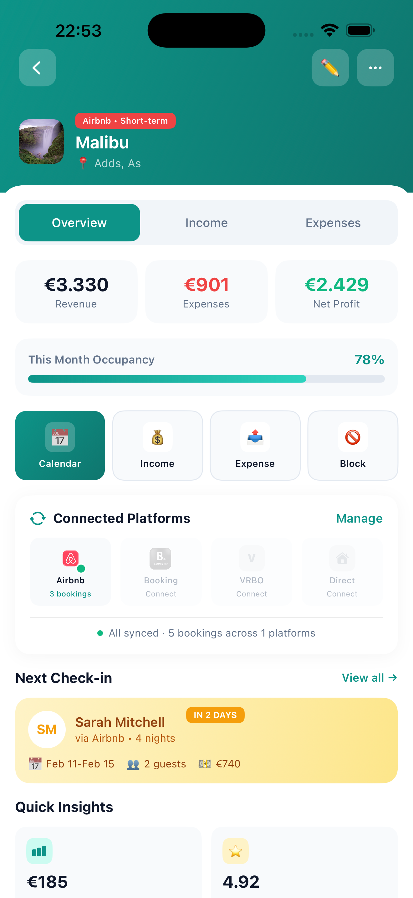
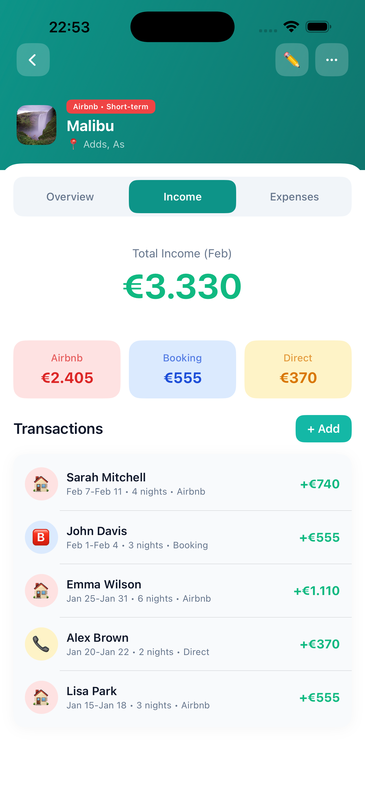
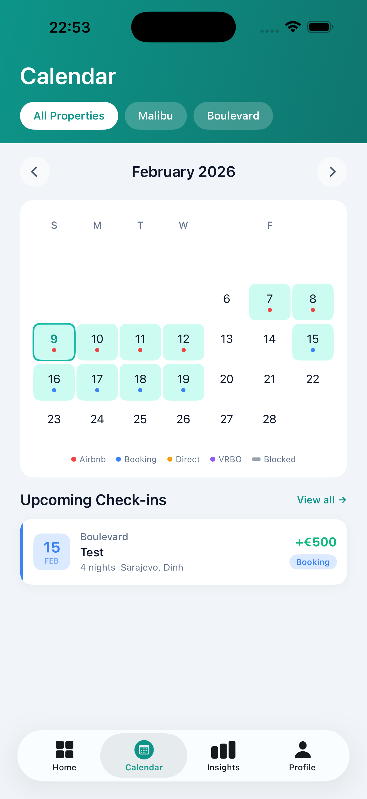
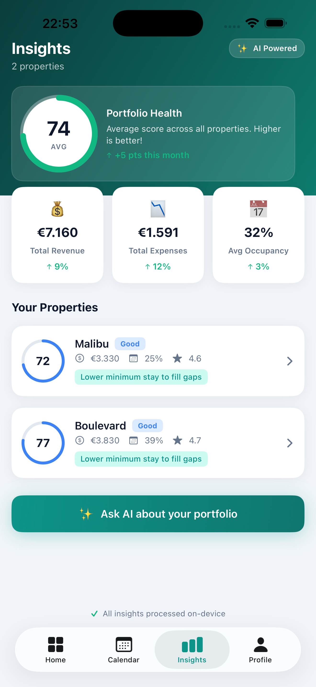

# RentDar

**Every detail. Every dollar.** A rental property management app for iOS built with SwiftUI and Core Data.

Track bookings, expenses, and income across multiple properties and platforms — all from your phone.

<p align="center">
  
</p>

## Screenshots

<p align="center">
  
  
  
  
</p>

## Features

- **Multi-property dashboard** — manage all your rentals in one place with revenue, expenses, and occupancy at a glance
- **Income & expense tracking** — log bookings and expenses per property, broken down by platform (Airbnb, Booking, VRBO, Direct)
- **Booking calendar** — visual calendar with color-coded bookings, upcoming check-ins, and blocked dates
- **Smart insights** — portfolio health score, revenue trends, expense analysis, and actionable recommendations
- **Platform integration** — connect Airbnb, Booking.com, and VRBO accounts to sync bookings
- **PDF reports** — export property reports for accounting or tax purposes
- **Dark mode** — full light and dark theme support
- **Localization** — multi-language support

## Tech Stack

- **SwiftUI** — declarative UI with adaptive light/dark theming
- **Core Data** — local persistence for properties, transactions, and blocked dates
- **MVVM architecture** — clean separation with `@Observable` ViewModels
- **No external dependencies** — 100% native Apple frameworks

## Requirements

- iOS 17.0+
- Xcode 16.0+

## Getting Started

1. Clone the repo
   ```bash
   git clone https://github.com/nasirhasanovic/Rent-Radar.git
   ```
2. Open `RentDar.xcodeproj` in Xcode
3. Build and run on simulator or device

## License

This project is for personal/portfolio use.
